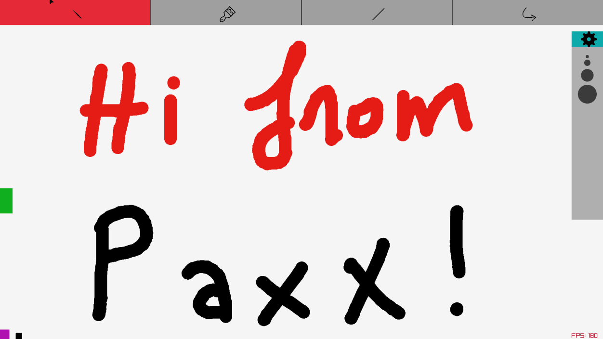

# Paxx paint app developed on raylib

### Controls: 
   LEFT CLICK       : draw, select toolbar items \\
   HOLD RIGHT CLICK : drag\\
   ESCAPE           : quit\\
   D                : darkmode\\

You only need raylib to build this. 

### Building: 

gcc build.c -o build && ./build && ./main

### TODO:
- [50/50] Some how undo system.
- [] Don't write in the background while clicking on GUI items.

